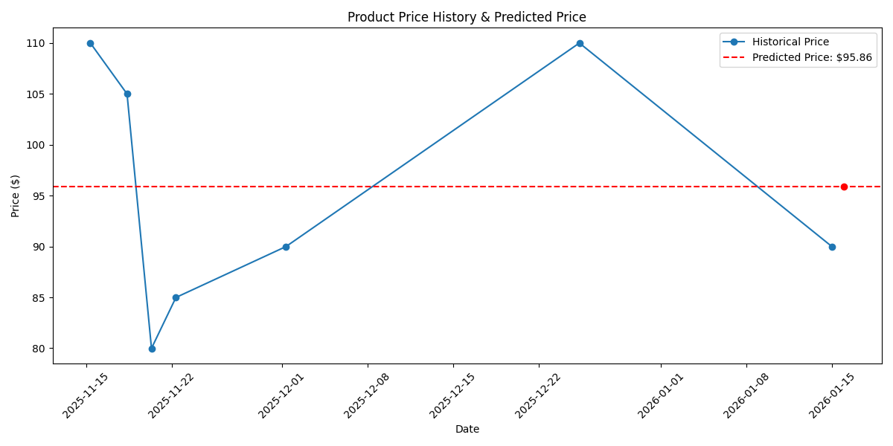

# Amazon Price Tracker

Track Amazon product prices over time and predict future price changes using Python, SQLite, and machine learning.

Features

- Scrape Amazon product pages for product title and price.

- Store historical prices in a local SQLite database (prices.db).

- Predict the next day’s price using a simple linear regression model.

- Plot historical and predicted prices with a visual chart.

- Supports daily scrapes at 8 am UTC via Cron (locally) or GitHub Actions.

